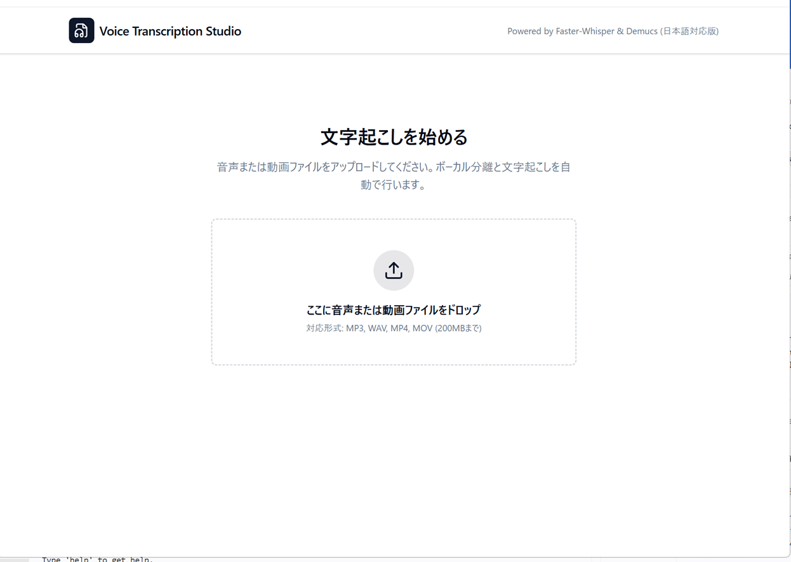
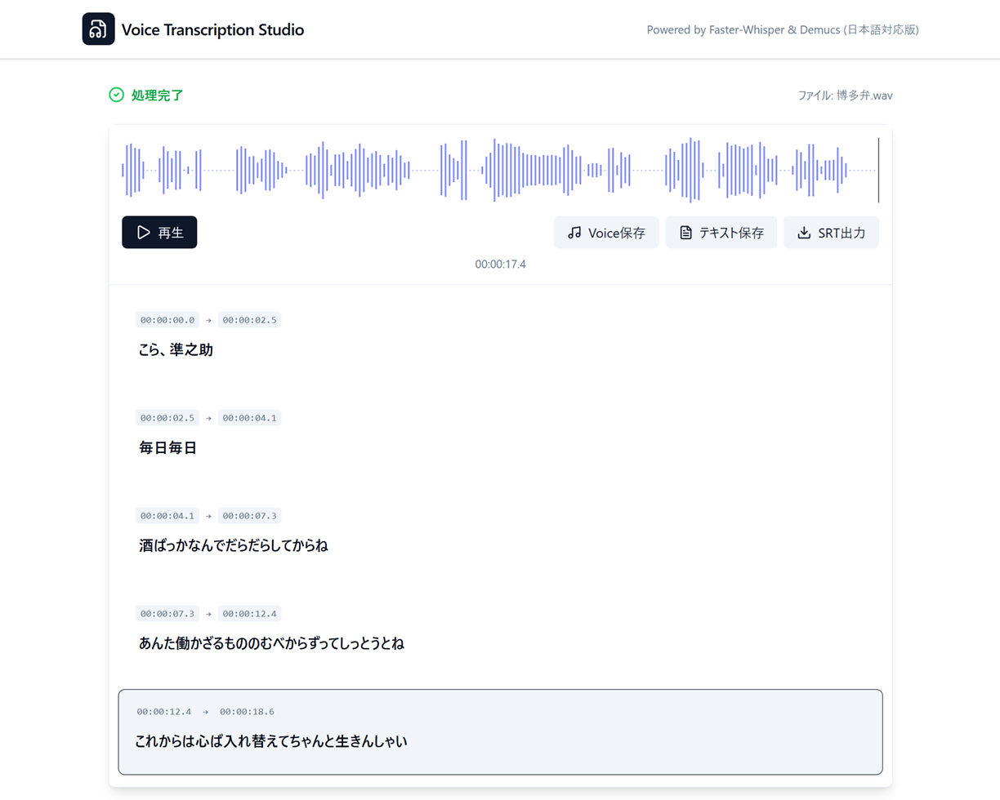

# Voice Transcription Studio

音声・動画ファイルをアップロードするだけで、AIが自動的にボーカル分離と文字起こしを行うWebアプリです。
文字起こし結果はブラウザ上で確認・編集でき、TXT / SRT形式でエクスポートできます。

## 技術スタック

| 役割 | 技術 |
|------|------|
| バックエンド | Python / FastAPI / Uvicorn |
| 文字起こし | Faster-Whisper |
| ボーカル分離 | Demucs |
| 音声処理 | FFmpeg / librosa / soundfile |
| フロントエンド | React / TypeScript / Vite |
| スタイリング | Tailwind CSS |
| 波形表示 | wavesurfer.js |

## 対応ファイル形式

`.mp3` / `.wav` / `.m4a` / `.mp4` / `.mov` / `.flac`

---

## セットアップ（初回のみ）

### 1. リポジトリをクローン

```
git clone <リポジトリURL>
cd VoiceTranscription
```

### 2. バックエンドの環境構築

```
cd backend
python -m venv venv
venv\Scripts\activate
pip install -r requirements.txt
```

> PyTorch（GPU版）を使用する場合は [https://pytorch.org](https://pytorch.org) を参照し、環境に合ったコマンドで別途インストールしてください。

### 3. フロントエンドの環境構築

```
cd frontend
npm install
```

---

## 起動方法

### 方法A：start.bat を使う（推奨）

プロジェクトルートの `start.bat` をダブルクリックするか、コマンドプロンプトで実行します。

```
start.bat
```

バックエンド（ポート8001）とフロントエンドが自動的に起動します。

### 方法B：手動で起動

**ターミナル1 — バックエンド**

```
cd backend
venv\Scripts\activate
python main.py
```

**ターミナル2 — フロントエンド**

```
cd frontend
npm run dev
```

### アクセス

ブラウザで以下のURLを開きます。

```
http://localhost:5152
```

LAN 上の別マシンからは `http://<サーバーのIPアドレス>:5152` でアクセスできます（API の接続先は自動的に同じホストの 8001 番になります）。接続先を明示したい場合は `frontend/.env.local` に `VITE_API_BASE_URL=http://<サーバーIP>:8001` を設定してください。

---

## 使い方

### 開始画面



1. ブラウザでアプリを開く
2. 音声・動画ファイルをドラッグ＆ドロップ、またはクリックして選択
3. アップロード後、自動でボーカル分離→文字起こしが実行される（数分かかる場合があります）

### 処理完了画面



4. 処理完了後、文字起こし結果が表示される
   - セグメントをクリックするとその位置から再生
   - テキストは直接編集可能
5. 完了したら保存・エクスポート
   - **テキスト保存（TXT）** — テキストファイルとしてダウンロード（編集結果はサーバー側の `transcription_corrected.json` にも保存されます）
   - **SRT出力** — 編集後のテキストを字幕ファイルとしてダウンロード

---

## フォルダ構造

```
VoiceTranscription/
├── backend/
│   ├── main.py            # FastAPI エントリポイント
│   ├── services.py        # タスク処理ロジック
│   ├── audio_processor.py # 音声処理（抽出・分離・文字起こし）
│   ├── config.py          # 設定（モデル名・パスなど）
│   ├── requirements.txt   # Python 依存パッケージ
│   └── uploads/           # アップロードファイル保存先（自動生成）
├── frontend/
│   ├── src/
│   │   ├── components/    # UIコンポーネント
│   │   ├── App.tsx        # メインアプリ
│   │   └── api.ts         # バックエンドAPI呼び出し
│   └── package.json
├── start.bat              # 起動スクリプト（Windows）
└── README.md
```

---

## API エンドポイント

| メソッド | パス | 説明 |
|---------|------|------|
| POST | `/upload` | ファイルアップロード・処理開始 |
| GET | `/tasks/{task_id}` | 処理ステータス確認 |
| GET | `/audio/{task_id}/{filename}` | 音声ファイル取得 |
| POST | `/save/{task_id}` | 文字起こし結果の保存 |

---

## トラブルシューティング

**起動しない場合**
- Python仮想環境（venv）が作成されているか確認してください
- `pip install -r requirements.txt` が完了しているか確認してください
- FFmpeg は `imageio-ffmpeg`（requirements.txt に含まれます）経由で自動解決されます。システムに FFmpeg をインストール済みの場合はそちらが優先されます

**文字起こし精度が低い場合**
- `backend/config.py` の `WHISPER_MODEL_NAME` を `base` から `large-v3` に変更すると精度が向上します（処理時間は増加）

**日本語が文字化けする場合（コマンドプロンプト）**
- `start.bat` はShift-JIS（CP932）で保存されています。テキストエディタで開く際はエンコーディングをShift-JISに設定してください
